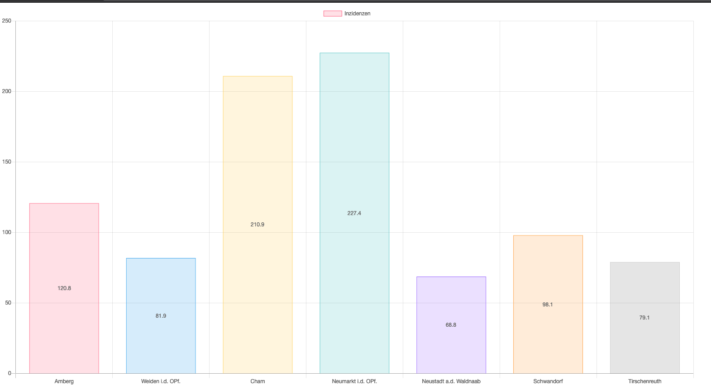

# CSCH - Corona Dashboard

## Dashboard Lizenz

/*
 * ----------------------------------------------------------------------------
 * "THE BEER-WARE LICENSE" (Revision 42):
 * Christof Schlögl wrote this file.  As long as you retain this notice you
 * can do whatever you want with this stuff. If we meet some day, and you think
 * this stuff is worth it, you can buy me a coffee in return.   Poul-Henning Kamp
 * ----------------------------------------------------------------------------
 */

## RKI Lizenz

Datenlizenz Deutschland – Namensnennung – Version 2.0

(1) Jede Nutzung ist unter den Bedingungen dieser „Datenlizenz Deutschland – Namensnennung – Version 2.0" zulässig.

Die bereitgestellten Daten und Metadaten dürfen für die kommerzielle und nicht kommerzielle Nutzung insbesondere

    vervielfältigt, ausgedruckt, präsentiert, verändert, bearbeitet sowie an Dritte übermittelt werden;
    mit eigenen Daten und Daten Anderer zusammengeführt und zu selbständigen neuen Datensätzen verbunden werden;
    in interne und externe Geschäftsprozesse, Produkte und Anwendungen in öffentlichen und nicht öffentlichen elektronischen Netzwerken eingebunden werden.

(2) Bei der Nutzung ist sicherzustellen, dass folgende Angaben als Quellenvermerk enthalten sind:

    Bezeichnung des Bereitstellers nach dessen Maßgabe,
    der Vermerk „Datenlizenz Deutschland – Namensnennung – Version 2.0" oder „dl-de/by-2-0" mit Verweis auf den Lizenztext unter www.govdata.de/dl-de/by-2-0 sowie
    einen Verweis auf den Datensatz (URI).

Dies gilt nur soweit die datenhaltende Stelle die Angaben 1. bis 3. zum Quellenvermerk bereitstellt.

(3) Veränderungen, Bearbeitungen, neue Gestaltungen oder sonstige Abwandlungen sind im Quellenvermerk mit dem Hinweis zu versehen, dass die Daten geändert wurden.

## jQuery, ChartJS, ChartJS-Datalabels

Copyright (c) <year> <copyright holders>

Permission is hereby granted, free of charge, to any person obtaining a copy of this software and associated documentation files (the "Software"), to deal in the Software without restriction, including without limitation the rights to use, copy, modify, merge, publish, distribute, sublicense, and/or sell copies of the Software, and to permit persons to whom the Software is furnished to do so, subject to the following conditions:

The above copyright notice and this permission notice shall be included in all copies or substantial portions of the Software.

THE SOFTWARE IS PROVIDED "AS IS", WITHOUT WARRANTY OF ANY KIND, EXPRESS OR IMPLIED, INCLUDING BUT NOT LIMITED TO THE WARRANTIES OF MERCHANTABILITY, FITNESS FOR A PARTICULAR PURPOSE AND NONINFRINGEMENT. IN NO EVENT SHALL THE AUTHORS OR COPYRIGHT HOLDERS BE LIABLE FOR ANY CLAIM, DAMAGES OR OTHER LIABILITY, WHETHER IN AN ACTION OF CONTRACT, TORT OR OTHERWISE, ARISING FROM, OUT OF OR IN CONNECTION WITH THE SOFTWARE OR THE USE OR OTHER DEALINGS IN THE SOFTWARE.